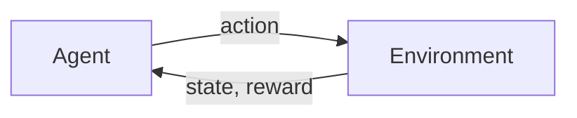

# 1.2 — Elements of Reinforcement Learning

> **Chapter 1: Introduction** · Book section: §1.3
> Previous: [1.1 — What is RL?](01-01-what-is-reinforcement-learning.md) · Next: [1.3 — Tic-Tac-Toe Example](01-03-tic-tac-toe-example.md)

---

## 🌱 The Big Picture

Beyond the **agent** (the learner/decision-maker) and the **environment** (everything the agent interacts with), every RL system has **four main sub-elements**. Learn these four words now — they appear on every page of the book:

| Element | One-line meaning | Analogy (human life) |
|---|---|---|
| **Policy** | What to do in each situation | Your habits / behavior |
| **Reward signal** | What is good *right now* | Pleasure and pain |
| **Value function** | What is good *in the long run* | Wisdom / foresight |
| **Model** (optional) | How the world works | Your mental picture of the world |

---

## 1️⃣ Policy — *the agent's behavior*

A **policy** is a mapping from perceived **states** to **actions** to be taken in those states.

- Written as $\pi$ (the Greek letter "pi").
- It can be a simple lookup table ("in state X, do action Y"), a function, or even involve a search process.
- It may be **stochastic**: instead of one fixed action, it gives *probabilities* of choosing each action. We write $\pi(a|s)$ = the probability of taking action $a$ when in state $s$.

> The policy is **the core of an RL agent** — it alone is sufficient to determine behavior. Everything else exists to *improve* the policy.

## 2️⃣ Reward Signal — *what is good, immediately*

On each time step, the environment sends the agent a single number: the **reward** $R_t$.

- The reward defines **the goal** of the problem.
- The agent's objective is to maximize the **total reward over the long run**, not the immediate one.
- Rewards are like **pleasure and pain** for an organism: immediate, primary feedback.
- The agent **cannot change** how rewards are computed — they define the problem, not the solution.

**Example:** for a chess agent, reward could be +1 for a win, −1 for a loss, 0 otherwise. *Not* "+0.5 for capturing a queen" — taking pieces is a *means*, not the goal. (More on this danger in Chapter 3.)

## 3️⃣ Value Function — *what is good, in the long run*

The reward tells you what's good *now*; the **value function** tells you what's good *eventually*.

> The **value of a state** is the total amount of reward an agent can expect to accumulate over the future, starting from that state.

A simple analogy:
- **Reward** = the immediate pleasure of eating a candy bar 🍫.
- **Value** = the long-term assessment that includes what comes later (sugar crash, health).

A state might give *low immediate reward* but have *high value* because it leads to great states (e.g., a chess sacrifice that wins the game). The reverse can also be true.

**Why values matter so much:**

- Action choices should be made based on **values, not rewards** — we want actions that lead to states of highest value, because those bring the most reward *over the long run*.
- Rewards are given directly by the environment; values must be **estimated and re-estimated** from experience. This is the hard part!

> 💡 **The most important sentence in this chapter:** *the central role of value estimation is arguably the most important thing that has been learned about reinforcement learning over the last six decades.*

## 4️⃣ Model — *how the world works (optional)*

A **model** of the environment is anything the agent can use to *predict* what the environment will do:

- Given a state and an action, a model might predict the **next state** and the **next reward**.
- Models enable **planning** — deciding on actions by considering possible futures *before actually experiencing them*.

This gives us an important vocabulary split:

| Term | Meaning |
|---|---|
| **Model-based methods** | Use a model to plan (think: chess engines simulating moves ahead) |
| **Model-free methods** | Pure trial-and-error, no model (think: learning by reflex) |

Modern RL spans the whole spectrum from low-level model-free learning to high-level deliberative planning — Chapter 8 brings these together.

---

## 🧠 Putting It Together — A Mini Example

Imagine a robot vacuum 🤖🧹:

- **State:** its position, battery level, dirt sensor readings.
- **Actions:** move forward, turn, return to dock.
- **Policy:** "if battery < 20%, head to dock; otherwise go toward dirt."
- **Reward:** +1 per unit of dirt collected, −10 if the battery dies mid-room.
- **Value:** the corner of the room near the dock might have *low immediate reward* (no dirt there) but *decent value* (safe, can recharge and keep cleaning later).
- **Model:** an internal map of the apartment used to plan routes.

---

## 🎯 Key Takeaways

1. **Policy** ($\pi$): state → action. The agent's behavior; the thing we ultimately want to improve.
2. **Reward** ($R$): immediate, defines the goal, given by the environment.
3. **Value function** ($v$): expected *long-term* reward; the basis for making good decisions; must be *estimated*. Value estimation is the heart of most RL algorithms.
4. **Model**: optional; enables planning. Methods split into *model-based* and *model-free*.
5. Memorize the mantra: **rewards are immediate, values are long-term; we seek values, but values come from rewards.**

---

➡️ **Next:** [1.3 — An Extended Example: Tic-Tac-Toe](01-03-tic-tac-toe-example.md) — see all four elements in action, plus your first real RL algorithm (temporal-difference learning).
