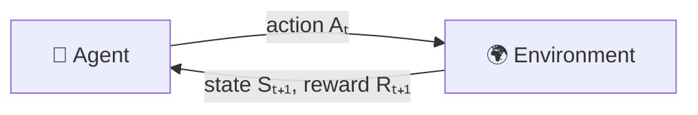

# 3.1 — The Agent–Environment Interface (Finite MDPs)

> **Chapter 3: Finite Markov Decision Processes** · Book section: §3.1
> Previous: [2.6 — Contextual Bandits](02-06-contextual-bandits-and-summary.md) · Next: [3.2 — Goals, Rewards, and Returns](03-02-goals-rewards-and-returns.md)

---

## 🌱 The Big Picture

This chapter defines **the problem** that the rest of the book solves: the **finite Markov Decision Process (MDP)**. Where bandits only asked *"which action is best?"*, MDPs ask the full question: *"which action is best **in each situation**, considering that actions change future situations?"*

> MDPs are the mathematically idealized form of the RL problem — the framework where precise theoretical statements can be made.

---

## 🔁 The interaction loop

At each discrete **time step** $t = 0, 1, 2, \dots$:

1. The agent observes the **state** $S_t \in \mathcal{S}$.
2. It selects an **action** $A_t \in \mathcal{A}(s)$.
3. One step later it receives a numerical **reward** $R_{t+1} \in \mathcal{R} \subset \mathbb{R}$ and finds itself in a new state $S_{t+1}$.

This produces the **trajectory**:

$$S_0, A_0, R_1, S_1, A_1, R_2, S_2, A_2, R_3, \dots$$

> ⚠️ **Notation gotcha:** the reward for action $A_t$ is $R_{t+1}$ (not $R_t$), because the reward and the next state arrive *together*, one step later. Most confusion in early reading comes from missing this.

"**Finite** MDP" = the sets of states, actions, and rewards are all finite.

---

## 🎲 The dynamics function — the heart of the MDP

For a finite MDP, everything about the environment is captured by one function:

$$p(s', r \mid s, a) \doteq \Pr\{S_t = s', R_t = r \mid S_{t-1} = s, A_{t-1} = a\}$$

Read: *"the probability of landing in state $s'$ with reward $r$, given that we were in state $s$ and took action $a$."* Since it's a probability distribution:

$$\sum_{s'} \sum_{r} p(s', r \mid s, a) = 1 \quad \text{for all } s, a$$

From $p$ you can derive everything else, e.g. state-transition probabilities $p(s'|s,a) = \sum_r p(s',r|s,a)$ and expected rewards $r(s,a) = \mathbb{E}[R_t | S_{t-1}{=}s, A_{t-1}{=}a]$.

### The Markov property 🏷️

Notice that $p$ depends only on the **current** state and action — not the whole history. This is the **Markov property**:

> The state must include all aspects of the past interaction that make a difference for the future. Once you know the state, the history doesn't matter.

**Analogy ♟️:** in chess, the current board position tells you everything you need to choose a move — *how* the pieces got there is irrelevant. The board is a Markov state. By contrast, "the last card you saw" in blackjack is *not* Markov — the cards already dealt matter too.

This is best seen as a restriction on the **state representation**, not on the world: it's our job (or the problem designer's) to construct states informative enough to be (approximately) Markov.

---

## 🚧 Where is the boundary between agent and environment?

Surprisingly subtle and important:

> **Anything the agent cannot change arbitrarily is considered part of the environment.**

- A robot's **motors and mechanical hardware** → environment (the agent can command them but not directly control their physics).
- An animal's **muscles, skeleton, sensory organs** → environment. The agent–environment boundary can be *inside* the body!
- The **reward computation** → always environment, by convention (the agent must not be able to change it arbitrarily — no wireheading 😄).
- The agent may *know* how the environment works (like knowing the rules of Rubik's cube) — knowledge ≠ control. It can still be a hard RL problem.

The boundary is the limit of the agent's **absolute control**, not of its knowledge.

---

## 🛠️ Designing the representation — examples

The MDP framework is abstract and flexible. Time steps need not be fixed clock-ticks; states can be raw sensations or abstract symbols; actions can be voltages or "go to lunch."

- **Bioreactor:** states = sensor readings + target chemical quantities; actions = target temperatures/stirring rates; rewards = rate of useful chemical produced.
- **Pick-and-place robot:** states = joint angles & velocities; actions = motor voltages; reward = +1 per object placed (plus small negative rewards for jerky motion).
- **Recycling robot (the book's running example 🤖🔋):** states = {`high`, `low`} battery charge. Actions = {`search` for cans, `wait`, `recharge`}. Searching earns the most reward but risks running the battery flat (big negative reward: −3, requiring rescue). The full dynamics fit in a small table / transition graph — we'll use this example in Chapters 3–4.

> 💡 Representation choice is more **art than science** — this book mostly assumes the representation is given and focuses on the learning.

---

## 🎯 Key Takeaways

1. MDP = agent and environment interacting at discrete steps via **states, actions, rewards**; trajectory $S_0, A_0, R_1, S_1, \dots$
2. The four-argument **dynamics function** $p(s', r|s, a)$ completely specifies a finite MDP.
3. **Markov property**: the state summarizes the past; the future depends only on the present state and action.
4. Boundary rule: agent = what it can control absolutely; everything else (body, sensors, reward calculator) = environment.
5. The framework is a great abstraction: *any* goal-directed learning problem can in principle be reduced to states, actions, and rewards.

---

➡️ **Next:** [3.2 — Goals, Rewards, and Returns](03-02-goals-rewards-and-returns.md) — what exactly is the agent trying to maximize, and how do we handle infinite time horizons?
