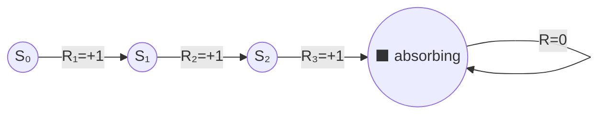

# 3.2 — Goals, Rewards, Returns, and Episodes

> **Chapter 3: Finite Markov Decision Processes** · Book sections: §3.2–§3.4
> Previous: [3.1 — Agent–Environment Interface](03-01-agent-environment-interface.md) · Next: [3.3 — Policies and Value Functions](03-03-policies-and-value-functions.md)

---

## 🏆 The Reward Hypothesis (§3.2)

Everything in RL rests on one bold claim:

> **The reward hypothesis:** all of what we mean by goals and purposes can be well thought of as the maximization of the expected value of the cumulative sum of a received scalar signal (the reward).

One number per time step — that's all the "goal" is. It sounds restrictive, but it has proven remarkably flexible:

- Maze escape: reward −1 per step (encourages speed 🏃).
- Recycling robot: + for cans, −3 for dead battery.
- Chess: +1 win, −1 loss, 0 otherwise.

### ⚠️ The #1 reward-design rule

> The reward signal must tell the agent **what** you want achieved, **not how** you want it achieved.

If you reward a chess agent for capturing pieces (a "how"), it may learn to maximize captures *even at the cost of losing the game*. Subgoals as rewards = agent finds loopholes. Prior knowledge about *how* belongs in the initial policy or value function, never in the reward.

---

## 📺 Episodic vs. Continuing Tasks (§3.3)

Two kinds of tasks:

| | **Episodic** | **Continuing** |
|---|---|---|
| Structure | Breaks into **episodes** that end in a **terminal state**, then reset | Goes on forever, no natural end |
| Examples | Games, maze runs, trips through a maze | Process control, a robot with a long life |
| Time horizon | Finite: $t = 0,\dots,T$ | Infinite |

---

## 💰 The Return — what we actually maximize

The agent maximizes the **expected return** $G_t$, a function of the reward sequence after time $t$.

### Episodic tasks: simple sum

$$G_t \doteq R_{t+1} + R_{t+2} + \cdots + R_T$$

### Continuing tasks: the sum would be infinite! Enter discounting 🪄

$$G_t \doteq R_{t+1} + \gamma R_{t+2} + \gamma^2 R_{t+3} + \cdots = \sum_{k=0}^{\infty} \gamma^k R_{t+k+1}$$

where $\gamma \in [0, 1]$ is the **discount rate** (or discount factor).

**How to think about γ:**

- A reward received $k$ steps in the future is worth $\gamma^k$ times an immediate reward.
- $\gamma = 0$: **myopic** agent — only the immediate reward matters (bandit-like).
- $\gamma \to 1$: **far-sighted** agent — future rewards count nearly as much as immediate ones.
- As long as $\gamma < 1$ and rewards are bounded, the infinite sum is **finite**. E.g. constant reward +1 forever: $G_t = \sum_k \gamma^k = \frac{1}{1-\gamma}$. With $\gamma = 0.9$ that's 10.

> 💸 **Analogy:** money. $100 next year is worth less than $100 today. γ is the agent's "interest rate" on rewards.

### The recursive identity you must memorize 🔁

$$\boxed{\,G_t = R_{t+1} + \gamma\, G_{t+1}\,}$$

*"The return from now = the next reward + discounted return from then on."* This one-liner powers the Bellman equations, TD learning — basically the whole book. Verify it by expanding: $G_t = R_{t+1} + \gamma(R_{t+2} + \gamma R_{t+3} + \cdots)$. ✅

### Worked example 🔢
Rewards from time $t$: $R_{t+1}=1,\; R_{t+2}=2,\; R_{t+3}=4$, then episode ends. With $\gamma=0.5$:

$$G_t = 1 + 0.5 \cdot 2 + 0.25 \cdot 4 = 3.0$$

Check recursively: $G_{t+2} = 4$; $G_{t+1} = 2 + 0.5(4) = 4$; $G_t = 1 + 0.5(4) = 3$. ✅

### Example: Pole-balancing 🎪 (one task, two framings)
- As **episodic**: reward +1 per step until failure → return = number of steps survived.
- As **continuing** with discounting: reward −1 at each failure, 0 otherwise → return ≈ $-\gamma^K$ where $K$ is steps until failure. Either way: balance longer = bigger return.

---

## 🔗 Unified Notation (§3.4)

To write one set of equations for both task types, the book uses a trick: treat episode termination as entering a special **absorbing state** that loops to itself forever with reward 0.

Then the general return covers both cases (allowing either $T = \infty$ or $\gamma = 1$, but not both):

$$G_t \doteq \sum_{k=t+1}^{T} \gamma^{\,k-t-1} R_k$$

---

## 🎯 Key Takeaways

1. **Reward hypothesis:** goals = maximizing expected cumulative scalar reward.
2. Reward says **what**, not **how** — never reward subgoals.
3. **Episodic** tasks sum rewards to $T$; **continuing** tasks need **discounting** with $\gamma < 1$.
4. $\gamma$ tunes far-sightedness; discounted infinite sums stay finite.
5. Memorize: $G_t = R_{t+1} + \gamma G_{t+1}$.

---

➡️ **Next:** [3.3 — Policies and Value Functions](03-03-policies-and-value-functions.md) — formal definitions of $\pi$, $v_\pi(s)$, and $q_\pi(s,a)$.
