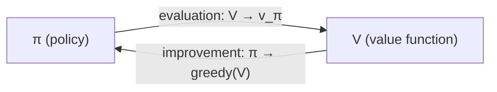

# 4.4 — Asynchronous DP, Generalized Policy Iteration & Efficiency

> **Chapter 4: Dynamic Programming** · Book sections: §4.5–§4.8
> Previous: [4.3 — Value Iteration](04-03-value-iteration.md) · Next: [5.1 — Monte Carlo Prediction](05-01-monte-carlo-prediction.md)

---

## 🌀 Asynchronous Dynamic Programming (§4.5)

Classic DP sweeps the **entire** state space each iteration — hopeless when the state set is huge (backgammon: $10^{20}$ states; one sweep = thousands of years 😱).

**Asynchronous DP** drops the sweep requirement:

> Update states **in any order whatsoever**, using whatever values of other states happen to be available. Some states may be updated many times before others are updated once.

- Convergence still guaranteed (for 0 ≤ γ < 1) as long as **every state continues to be updated** — you can't permanently ignore any state.
- Huge flexibility: update states along an agent's actual trajectory! Focus computation on states the agent actually visits, skipping irrelevant ones. This intermixing of **real-time interaction and computation** is a recurring theme (it returns in Ch. 8 as real-time dynamic programming).
- It doesn't necessarily mean *less* total computation — it means you don't get **locked into** hopelessly long sweeps before making any progress.

---

## ♻️ Generalized Policy Iteration — the master pattern (§4.6)

Step back and squint at everything we've done. Two processes are interacting:

1. **Policy evaluation:** make the value function consistent with the current policy.
2. **Policy improvement:** make the policy greedy with respect to the current value function.

**Generalized Policy Iteration (GPI)** = letting these two processes interact at *any* granularity — full sweeps, single sweeps, single states, even single samples — regardless of the details.

> **Almost all RL methods are GPI.** Policy iteration, value iteration, async DP, Monte Carlo control, Sarsa, Q-learning, actor–critic — all maintain an (approximate) policy and an (approximate) value function, each chasing the other.

The two processes **compete and cooperate**:
- Making the policy greedy w.r.t. V makes V *wrong* for the new policy (competition).
- Making V accurate for π exposes π's weaknesses (more competition).
- Yet jointly they spiral toward a single fixed point: $\pi_*$ and $v_*$ — where the policy is greedy w.r.t. its **own** value function = Bellman optimality. ✨ (cooperation)

Keep the GPI picture in your head for the entire book. When you meet a confusing new algorithm, ask: *"how is this doing evaluation, and how is it doing improvement?"*

---

## ⏱️ Efficiency of DP (§4.7)

- DP finds an optimal policy in time **polynomial** in the number of states $n$ and actions $k$ — even though the number of deterministic policies is $k^n$ (exponential!). DP is *exponentially faster* than brute-force policy search.
- Compared with **linear programming** (the other exact approach): LP has better worst-case bounds but becomes impractical ~100× sooner than DP. For large problems, **DP is the only feasible exact method**.
- The real enemy: the **curse of dimensionality** — state spaces grow exponentially with the number of state variables. That's a property of the *problem*, not of DP. DP today routinely handles millions of states.
- In practice, policy iteration and value iteration converge **much faster** than their worst-case bounds, especially with good initial values. Async methods + good initialization often crack big problems.

---

## 📋 Chapter 4 Summary

| Concept | One-liner |
|---|---|
| Policy evaluation | Iteratively compute $v_\pi$ for fixed π (expected updates) |
| Policy improvement | Greedify the policy w.r.t. its value function — never worse |
| Policy iteration | Alternate the above to optimality |
| Value iteration | Same, with evaluation truncated to one sweep (Bellman optimality update) |
| Async DP | Any update order; enables focusing on relevant states |
| **GPI** | The universal evaluate⇄improve dance — the skeleton of nearly all RL |
| Bootstrapping | DP updates estimates **from other estimates** — a theme TD learning inherits |

One more word to bank: DP methods **bootstrap** — they update value estimates based on *other value estimates* (the successor states' values). Monte Carlo (next chapter) does **not** bootstrap; TD learning (Ch. 6) does. This distinction organizes the next three chapters.

---

## 🎯 Key Takeaways

1. Async DP: update any states in any order — just don't starve any state forever.
2. **GPI = evaluation ⇄ improvement** at any granularity. The fixed point is optimality. Nearly all of RL fits this template.
3. DP is polynomial-time and the practical exact method; the curse of dimensionality is the problem's fault, not DP's.
4. DP **bootstraps** and needs a **perfect model**. Next two chapters relax each requirement: Monte Carlo (no model, no bootstrap) and TD (no model, bootstrap).

---

➡️ **Next chapter:** [5.1 — Monte Carlo Prediction](05-01-monte-carlo-prediction.md) — learning value functions from **actual experience** alone, with no model whatsoever.
