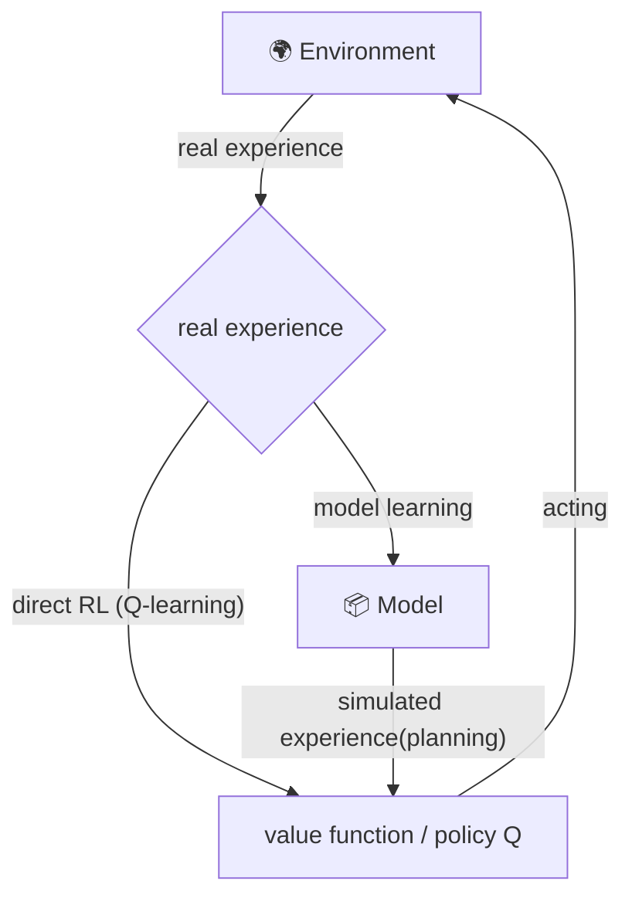

# 8.2 — Dyna-Q: Integrated Planning, Acting, and Learning

> **Chapter 8: Planning and Learning with Tabular Methods** · Book sections: §8.2–§8.3
> Previous: [8.1 — Models and Planning](08-01-models-and-planning.md) · Next: [8.3 — Prioritized Sweeping & Update Choices](08-03-prioritized-sweeping-and-update-choices.md)

---

## 🌱 The Big Picture

**Dyna** is the architecture that fuses everything: the agent **acts** in the world, **learns** values from real experience, **learns a model** from the same experience, and **plans** (simulated updates) in the background — all simultaneously, online.



Real experience improves Q **directly** (direct RL) and **indirectly** via the model (planning). Each path has advantages: indirect use squeezes more out of limited experience; direct use is simpler and immune to model errors.

---

## ⚙️ The Dyna-Q algorithm

Per interaction with the world, do **one real update** and **n simulated updates**:

```text
Tabular Dyna-Q:
loop forever:
    (a) S ← current state
    (b) A ← ε-greedy(S, Q)
    (c) take A; observe R, S′
    (d) Q(S,A) += α [ R + γ max_a Q(S′,a) − Q(S,A) ]          ← direct RL
    (e) Model(S,A) ← (R, S′)        ← model learning (deterministic world: just memorize)
    (f) repeat n times:                                        ← planning!
            S̄ ← random previously-seen state
            Ā ← random action previously taken in S̄
            (R̄, S̄′) ← Model(S̄, Ā)
            Q(S̄,Ā) += α [ R̄ + γ max_a Q(S̄′,a) − Q(S̄,Ā) ]
```

Same Q-learning update powers both learning and planning — the only difference is the source of experience. 💡

### How much does planning help? (book Example 8.1: Dyna Maze 🐭)

A simple maze, reward +1 at the goal. Compare n = 0 (plain Q-learning) vs n = 5 vs n = 50 planning steps per real step:

- **n = 0:** needs ~25 episodes to reach optimal.
- **n = 5:** ~5 episodes.
- **n = 50:** ~**3 episodes**! 🚀

**Why:** after the first episode, plain Q-learning has learned only *one* state–action value (the step into the goal). Dyna-Q **replays remembered transitions mentally**, propagating that value backwards through the model *between* real steps. By episode 3 the policy is nearly complete. Planning converts memory + compute into sample efficiency.

---

## 🧨 When the Model Is Wrong (§8.3)

Models can be wrong: environment is stochastic and under-sampled, function approximation is imperfect, or — most interestingly — **the environment changed**. Planning then computes a policy optimal *for the wrong world*.

Two flavors (book Examples 8.2–8.3):

- **Blocking Maze:** the world gets *worse* (the old shortcut is walled off). The agent's plans fail, it gets less reward than expected, reality corrects the model where it acts → recovers. Modeled errors that make the agent *optimistic* get discovered and fixed quickly. 😅
- **Shortcut Maze:** the world gets *better* (a new shortcut opens). **Much harder!** The agent's policy still works fine, so it never visits the shortcut region, never discovers the improvement, and may *never* find the better path. The exploration/exploitation dilemma in model form.

### Dyna-Q+ — curiosity bonus 🔭

Fix: encourage re-testing long-untried transitions. Track how long since each pair $(s,a)$ was tried ($\tau$); during **planning**, add an exploration bonus to the modeled reward:

$$\tilde r = r + \kappa \sqrt{\tau}$$

The agent "daydreams" that stale parts of the world might have improved, and periodically re-checks them. Dyna-Q+ solves the shortcut maze and even outperforms Dyna-Q on the blocking maze. (Yes, the bonus buys exploration at some cost — but here it's worth it.)

---

## 🎯 Key Takeaways

1. **Dyna = act + direct RL + model-learn + plan**, all interleaved; planning replays model samples through the same Q-learning update.
2. Even a few planning steps per real step slashes the real experience needed (25 → 3 episodes in the maze).
3. Wrong models: optimism self-corrects; **missed improvements don't** — exploration is needed at the model level too.
4. Dyna-Q+ adds a $\kappa\sqrt{\tau}$ bonus for long-untested actions — model-based curiosity.

---

➡️ **Next:** [8.3 — Prioritized Sweeping & Expected vs Sample Updates](08-03-prioritized-sweeping-and-update-choices.md) — planning smarter, not harder: *which* simulated updates are worth doing?
