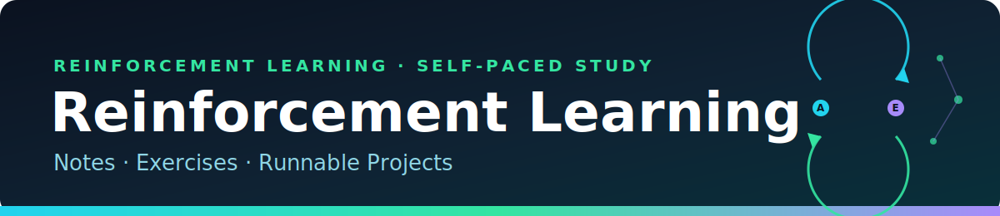

# 📦 Reinforcement Learning — Resources

[Home](../index.md) &nbsp;|&nbsp; [Notes](../01-notes/README.md) &nbsp;|&nbsp; [Exercises](../02-exercises/README.md) &nbsp;|&nbsp; [Quiz Hub](../03-quiz/) &nbsp;|&nbsp; [Projects](../04-projects/README.md)

Reference material that backs the notes, exercises, and projects.

## The Textbook

Everything here is a companion to:

> **Sutton, R. S., &amp; Barto, A. G. (2018).** *Reinforcement Learning: An Introduction* (2nd ed.). MIT Press.

The book PDF (`RL_BartoSutton.pdf`) lives in this folder in the repository. It is freely available from the authors, so it is kept **local-only** (git-ignored) rather than committed here — download your own copy from the official page below.

| Resource | Where |
| --- | --- |
| Official book page &amp; free PDF | [incompleteideas.net/book/the-book-2nd.html](http://incompleteideas.net/book/the-book-2nd.html) |
| Authors' code (Python) | [github.com/ShangtongZhang/reinforcement-learning-an-introduction](https://github.com/ShangtongZhang/reinforcement-learning-an-introduction) |
| Errata &amp; solutions discussion | linked from the official book page |

## How the Layers Map to the Book

| This repo | Book coverage |
| --- | --- |
| [Notes](../01-notes/README.md) | Chapters 1–17, one page per major concept |
| [Exercises](../02-exercises/README.md) | Chapter-by-chapter problem sets with worked answers |
| [Projects](../04-projects/README.md) | The book's flagship examples, built from scratch in numpy |

## Prerequisites

| Tool | Used for |
| --- | --- |
| Python 3.9+ | Running the projects |
| numpy | The only hard dependency ([`04-projects/requirements.txt`](../04-projects/requirements.txt)) |
| matplotlib | Optional — scripts print results and only plot if it is installed |
| A little calculus &amp; probability | Following the derivations in the notes |

> `05-resources/` intentionally keeps large/copyrighted files out of git via [`.gitignore`](.gitignore); only this page is published to the site.
